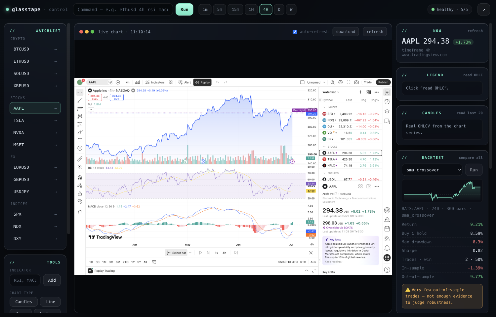
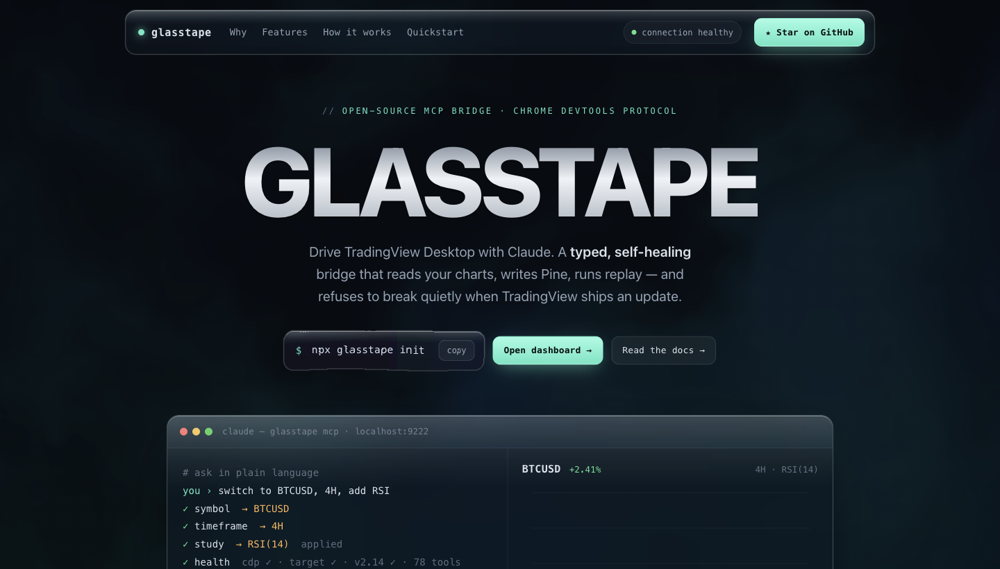

# glasstape

**A typed, self-healing MCP bridge between Claude and TradingView Desktop — plus a standalone backtesting engine.**

glasstape lets Claude (or any [Model Context Protocol](https://modelcontextprotocol.io) client) read your charts, switch symbols and timeframes, add indicators, draw on the chart, write Pine Script, and read real OHLCV — by driving your **locally running TradingView Desktop** over the Chrome DevTools Protocol. It also ships a **web dashboard**, a **CLI**, and a **backtesting engine that runs on its own market data** (no TradingView required).

```
Claude / dashboard ─▶ MCP + HTTP ─▶ typed tools ─▶ TV adapter ─▶ CDP ─▶ TradingView Desktop (:9222)
                                          └▶ backtest engine ◀─ Binance OHLCV (standalone)
```



> **How it was built:** driving TradingView meant reverse-engineering an app with
> no automation API — real mouse events for React, CDP **focus emulation** to beat
> `document.hasFocus()` gating, and calling TradingView's internal charting API
> directly for drawings and data. The full story:
> **[docs/REVERSE-ENGINEERING.md](docs/REVERSE-ENGINEERING.md).**

---

## Why glasstape

| | Typical JS bridge | glasstape |
|---|---|---|
| **Breakage** | cryptic stack trace when TradingView changes | version detection + selector **self-test**; `health`/`doctor` tell you *exactly* what moved |
| **Types** | loose JavaScript | end-to-end TypeScript; every tool has a **Zod** schema validated at the boundary |
| **Fragility** | DOM knowledge scattered everywhere | all TradingView-specific knowledge **quarantined** in `src/tv/` |
| **Resilience** | one selector per element | **ordered fallback strategies** per element, first match wins |
| **Testing** | manual only | pure logic unit-tested; a `tv` CLI to drive everything without Claude |

## Requirements

- **Node.js 18+**
- **TradingView Desktop** (the native app — this does not work against the website in a normal browser)
- A TradingView plan appropriate for the features you use (e.g. Bar Replay needs a paid plan)

## Quickstart

```bash
# 1. install & build
npm install
npm run build

# 2. launch TradingView with the debug port (quits & relaunches it)
./scripts/launch-macos.sh          # or launch-windows.ps1 / launch-linux.sh

# 3. verify the bridge sees it
node dist/cli/index.js health
```

A healthy check looks like:

```
● HEALTHY
  CDP        connected  (127.0.0.1:9222)
  target     BTCUSD · 63,000 — TradingView
  TradingView yes
  selectors  5/5 resolving
```

### Connect it to Claude Code

Copy `.mcp.json.example` to your project's `.mcp.json` (or merge it into your existing one):

```json
{
  "mcpServers": {
    "glasstape": {
      "command": "node",
      "args": ["dist/cli/index.js", "serve"],
      "env": { "GLASSTAPE_PORT": "9222" }
    }
  }
}
```

Then just ask Claude:

> "Switch to ETHUSD on the 4H, add an RSI, and screenshot it."

## Web dashboard



Prefer clicking to talking? glasstape ships a **dark glass control panel** backed
by a small HTTP API — no Claude required:

```bash
npm run build
node dist/cli/index.js http        # serves on http://localhost:8787
# open the dashboard:
open http://localhost:8787/app/
```

The dashboard gives you a connection status light, a command bar, symbol +
timeframe + indicator + chart-type + drawing + replay controls, a live chart
preview (auto-refreshing screenshot of your TradingView), a legend readout, a
screenshot gallery, and a Pine Script injector — every control wired to the same
engine the MCP tools use. The landing page (`http://localhost:8787/`) links to it.

> **Local & unauthenticated.** The server binds to `127.0.0.1` only and has no
> auth — it grants full control of your logged-in TradingView session. Don't
> port-forward it or run it on a shared/untrusted machine.

### Control reliability (verified against a live TradingView session)

These drive TradingView's real UI, so reliability varies by build. Current status:

| Control | Status |
|---|---|
| symbol, timeframe, chart type, indicators, replay, alerts, screenshot, health | ✅ verified working |
| **drawings (horizontal + trend), remove/list drawings** | ✅ verified working — created through TradingView's internal charting API (`createShape` / `createMultipointShape`), so both line types place reliably with exact coordinates (a horizontal line can be pinned to an exact price) |
| **candles (real OHLCV)** | ✅ verified working — `get_candles` reads the chart's actual series data (time/open/high/low/close/volume), not scraped from the legend |
| multi-chart layout | TradingView plan limit — multi-chart grids require a paid plan. On single-chart plans `set_layout` returns `applied:false` with a clear note (it drives the internal layout API, which the plan no-ops). |

Drawings and candle reads go through TradingView's internal charting API
(`window.TradingViewApi.activeChart()`) — discovered and quarantined in
`src/tv/adapter.ts`. It's more powerful and reliable than DOM/mouse simulation,
at the cost of being an undocumented interface (the usual glasstape tradeoff).

The bridge enables **CDP focus emulation** on connect (`Emulation.setFocusEmulationEnabled`)
so the page always reports `document.hasFocus() === true`. TradingView gates dialog
searches (e.g. the indicators dialog) on focus, so without this they silently fail to
filter when the window isn't the OS-frontmost one — this is what makes headless control work.

When something misbehaves, run `glasstape doctor` — every fragile hook lives in `src/tv/selectors.ts`.

The HTTP API (handy for your own scripts):

| Method · Path | Does |
|---|---|
| `GET /api/health` | full health report |
| `GET /api/state` | current symbol/timeframe |
| `POST /api/symbol` `{symbol}` | switch symbol |
| `POST /api/timeframe` `{timeframe}` | switch interval |
| `GET /api/screenshot` | PNG of the chart |
| `GET /api/legend` | OHLC/indicator values |
| `GET /api/candles` `?count=N` | real OHLCV candle data from the series |
| `POST /api/drawing` `{kind,price?}` | add a horizontal/trend line (price pins a level) |
| `GET /api/drawings` | list drawings on the chart |
| `POST /api/drawings/clear` | remove all drawings |
| `GET /api/strategies` | list built-in backtest strategies |
| `POST /api/backtest` `{strategy,params?,count?}` | backtest a strategy on the chart's candles |
| `POST /api/pine` `{source}` | inject Pine source |

## CLI

The `glasstape` CLI mirrors the tools so you can test without an MCP client:

```
glasstape serve                 Start the MCP server on stdio
glasstape http [port]           Start the HTTP API + web dashboard (:8787)
glasstape health                Full connection + selector health check
glasstape doctor                Selector self-test (which UI hooks resolve)
glasstape state                 Print the current chart state
glasstape symbol BTCUSD         Switch symbol
glasstape timeframe 4H          Switch timeframe (1,5,15,60,240,4H,D,W,1mo…)
glasstape legend                Print legend OHLC/indicator values
glasstape screenshot [path]     Save a PNG screenshot
glasstape backtest BTCUSDT 4h sma_crossover   Backtest on Binance data (no TradingView)
glasstape eval "<expr>"         Evaluate JS in the page (advanced)
glasstape targets               List CDP targets on the debug port
glasstape tools                 List the MCP tools
```

## MCP tools

| Tool | What it does |
|---|---|
| `health` | Full bridge diagnostic: CDP, target, version, selector self-test |
| `get_chart_state` | Current symbol, timeframe, title, URL |
| `set_symbol` | Switch symbol via the search dialog |
| `set_timeframe` | Switch interval via the interval menu |
| `get_legend` | OHLC + indicator values from the legend |
| `get_candles` | Real OHLCV candle data from the chart series |
| `add_drawing` | Add a horizontal (price-pinned) or trend line via the internal API |
| `remove_all_drawings` / `list_drawings` | Manage chart drawings |
| `backtest` | Backtest a strategy on the chart's candles (our engine; IS/OOS + overfit check) |
| `list_strategies` | List built-in strategies + default params |
| `focus_chart` | Give keyboard focus to the chart |
| `screenshot` | Capture the window (optionally clipped) |
| `pine_set_source` | Write Pine source into the open Pine Editor |
| `pine_get_console` | Read Pine console output |
| `pine_get_errors` | Read Pine compile error markers |
| `list_targets` | List CDP targets (diagnostics) |
| `tv_evaluate` | Advanced escape hatch: run JS in the page |

## Backtesting (our own engine)

Everything else in glasstape is a bridge to TradingView. The backtester is the
part that's **genuinely ours**: `src/backtest/` is pure, dependency-free TS that
takes TradingView's candle data (`get_candles`) and runs a real simulation.

- **Vectorized, long-only engine** with fees + slippage and **no look-ahead**
  (a position decided at bar *i*'s close only affects bar *i+1*).
- **Metrics:** total return vs buy-and-hold, CAGR, max drawdown, annualised
  Sharpe, win rate, profit factor, exposure, per-trade stats.
- **Overfitting guardrail:** every run reports **in-sample vs out-of-sample**
  metrics and a plain-English warning when the edge doesn't generalise — the
  thing in-chart backtesting won't tell you.
- **Built-in strategies:** `sma_crossover`, `rsi_reversion`, `breakout`
  (parameterizable). The engine takes any 0/1 position series, so new strategies
  are trivial to add.
- Fully unit-tested (indicators, engine, strategies, splits) — no browser needed.

```bash
curl -s -XPOST localhost:8787/api/backtest \
  -H 'content-type: application/json' \
  -d '{"strategy":"sma_crossover","params":{"fast":10,"slow":30},"count":300}'
```

## Configuration

| Env var | Default | Meaning |
|---|---|---|
| `GLASSTAPE_PORT` | `9222` | CDP debug port TradingView was launched with |
| `GLASSTAPE_HOST` | `127.0.0.1` | CDP host |
| `GLASSTAPE_LOG` | `info` | `silent\|error\|warn\|info\|debug` (logs go to **stderr**) |
| `GLASSTAPE_EVAL_TIMEOUT_MS` | `15000` | Per-evaluation timeout |

## Architecture

Layered so the fragile parts can't poison the stable parts. See [`docs/superpowers/specs/2026-06-25-glasstape-design.md`](docs/superpowers/specs/2026-06-25-glasstape-design.md) for the full design.

```
src/
  cdp/       transport: chrome-remote-interface, target discovery, reconnect, evaluate/input
  tv/        the ONLY TradingView-specific code (selectors, adapter, pine, intervals, version)
  domains/   typed tool definitions (chart, pine, capture, system)
  mcp/       registry + stdio server (Zod → JSON Schema, validate, dispatch)
  health/    end-to-end diagnostic
  cli/       `glasstape <command>`
  util/      errors, logger (stderr-only), retry/backoff
web/         the landing page (design prototype)
```

**When TradingView breaks something, you only touch `src/tv/selectors.ts`.** Run `glasstape doctor` to see which hooks stopped resolving.

## Development

```bash
npm run dev -- health     # run the CLI from source (tsx)
npm run typecheck         # tsc --noEmit
npm test                  # vitest (31 unit tests)
npm run build             # emit dist/
```

## How it works (and what's solid vs. best-effort)

glasstape talks to the Electron debug interface TradingView Desktop exposes when launched with `--remote-debugging-port`. **No data is sent to any server** — everything is local.

- **Solid today:** CDP connect & target discovery, `health`/`doctor`, screenshots, reading chart state, `tv_evaluate`, symbol switching, timeframe switching.
- **Best-effort / tune on first run:** the exact DOM selectors in `src/tv/selectors.ts` track TradingView's current build. If a hook doesn't resolve, `doctor` flags it and you update one file. Pine source-injection needs the Pine Editor open (it uses Monaco's model API).

## Legal & safety

> ⚠️ **Unofficial and experimental.** glasstape is **not affiliated with, endorsed by, or associated with TradingView, Inc.** It drives undocumented internal interfaces over CDP and **can break on any TradingView update**. You are responsible for complying with [TradingView's Terms of Use](https://www.tradingview.com/policies/) — automated or non-display use of their data may conflict with those terms. Provided for **personal, educational, and research use**. All processing is local.
>
> **Security note:** connecting an MCP client grants it the ability to run actions in your logged-in TradingView session. The `tv_evaluate` tool in particular executes arbitrary JavaScript inside the page (an intentional power-user escape hatch) and therefore has full access to that session's state. Only connect clients you trust, and consider removing `tv_evaluate` from `src/domains/system.ts` if you don't need it.

## License

[MIT](LICENSE) — applies to glasstape source only, not to TradingView's software, data, or trademarks.
